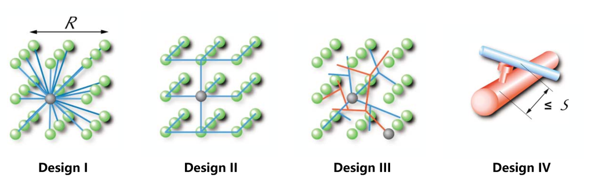

<!-- ============================================================
  课程主页 —— CS 61A 浅蓝风格 + Princeton 字符风格
  主页（本页）：课程信息 / 公告 / 子页入口 / 资源
  单页主页：课程信息 + 公告 + 大课表 + 资源；子页 syllabus.qmd（教学大纲）
  占位内容均标有 TODO，请替换为真实信息。
============================================================ -->

<h1>Computational Neuroscience</h1>

BIO4502e.01, University of Science and Technology of China (Fall 2026) <!-- TODO: 学校名与学期 -->

<b>time</b>: 2(3,4), Week 1-18 <!-- TODO: 上课时间 -->

<b>location</b>: Room 2307 <!-- TODO: 教室 -->

<b>instructor</b>: Prof. Quan Wen <!-- TODO: 讲师姓名与主页链接 -->

<b>TA</b>: Qilin Zhang (office hours: Sat 7-8pm &amp; by appt, LSB 205, West Campus)

<!-- 原版示意图（Bair & Koch 1996 raster），如需更换直接替换 images/ 下文件。
     注意：HTML 标签不能缩进 4 空格，否则会被 Markdown 当成代码块 -->

**prerequisites:** High school knowledge of neuroscience. A good working knowledge of multivariable calculus,
probability theory, linear algebra and differential equations. Familiarity of a programming language. 

**brief description:** In this course, we will explore how physics, engineering, and mathematics have shaped our understanding of the brain. In particular, we will investigate the relationship between structure, dynamics, representation, and behavior. Special topics may include wiring optimization in neural circuit, attractor and chaotic dynamics in neural network, sensory and motor representation, biological learning rules, Hopfield network, and hierarchical control of behaviors. We will also discuss connections with modern machine learning methods. 

<b>contact:</b>

<ul class="contact-list">
<li>TA: <a href="mailto:zhangqilin8879@mail.ustc.edu.cn">zhangqilin8879@mail.ustc.edu.cn</a></li>
<li>QQ group: 1092785505</li>
</ul>

**discussion:** Students are encouraged to post discussion on the GitHub [issue page](https://github.com/Wenlab/Computation-Neuro-Course/issues).

<ul class="announcements" id="announcements">
<li>Aug 29, 2026 Welcome! Course homepage is live.</li>
</ul>

Lecture Schedule

<table class="table">
<colgroup>
<col style="width: 5%;">
<col style="width: 5%;">
<col style="width: 30%;">
<col style="width: 15%;">
<col style="width: 10%;">
<col style="width: 10%;">
<col style="width: 20%;">
</colgroup>
<thead>
<tr><th style="text-align: center;">Week</th><th style="text-align: center;">Date</th><th>Topic</th><th>Readings</th><th>Slides</th><th>Notes</th><th>Homework</th></tr>
</thead>
<tbody>
<tr class="week-odd"><td rowspan="1" style="text-align: center;">W1</td><td style="text-align: center;">Tue 9/1</td><td>Course Intro</td><td><a href="readings/Introduction.pdf">Introduction</a></td><td><a href="slides/Lec.01.html">Lec.01</a> </td><td><a href="notes/lec01.pdf">Notes.01</a></td><td></td></tr>
<tr class="week-even"><td rowspan="1" style="text-align: center;">W2</td><td style="text-align: center;">Tue 9/8</td><td></td><td></td><td></td><td></td><td></td></tr>
<tr class="week-odd"><td rowspan="1" style="text-align: center;">W3</td><td style="text-align: center;">Tue 9/15</td><td></td><td></td><td></td><td></td><td></td></tr>
<tr class="week-even"><td rowspan="1" style="text-align: center;">W4</td><td style="text-align: center;">Tue 9/22</td><td></td><td></td><td></td><td></td><td></td></tr>
<tr class="week-odd"><td rowspan="1" style="text-align: center;">W5</td><td style="text-align: center;">Tue 9/29</td><td></td><td></td><td></td><td></td><td><a href="homework/hw1.pdf">HW1</a> Due 10.11</td></tr>
<tr class="week-even"><td rowspan="2" style="text-align: center;">W6</td><td style="text-align: center;">Tue 10/6</td><td></td><td></td><td></td><td></td><td></td></tr>
<tr class="week-even"><td style="text-align: center;">Sat 10/10</td><td></td><td></td><td></td><td></td><td></td></tr>
<tr class="week-odd"><td rowspan="1" style="text-align: center;">W7</td><td style="text-align: center;">Tue 10/13</td><td></td><td></a></td><td></td><td></td><td></td></tr>
<tr class="week-even"><td rowspan="1" style="text-align: center;">W8</td><td style="text-align: center;">Tue 10/20</td><td></td><td></td><td></td><td></td><td></td></tr>
<tr class="week-odd"><td rowspan="1" style="text-align: center;">W9</td><td style="text-align: center;">Tue 10/27</td><td></td><td></td><td></td><td></td><td></td></tr>
<tr class="week-even"><td rowspan="1" style="text-align: center;">W10</td><td style="text-align: center;">Tue 11/3</td><td></td><td></td><td></td><td></td><td></td></tr>
<tr class="week-odd"><td rowspan="1" style="text-align: center;">W11</td><td style="text-align: center;">Tue 11/10</td><td></td><td></td><td></td><td></td><td></td></tr>
<tr class="week-even"><td rowspan="1" style="text-align: center;">W12</td><td style="text-align: center;">Tue 11/17</td><td></td><td></td><td></td><td></td><td style="text-align: center;"></td></tr>
<tr class="week-odd"><td rowspan="1" style="text-align: center;">W13</td><td style="text-align: center;">Tue 11/24</td><td></td><td></td><td></td><td></td><td></td></tr>
<tr class="week-even"><td rowspan="1" style="text-align: center;">W14</td><td style="text-align: center;">Tue 12/1</td><td></td><td></td><td></td><td></td><td></td></tr>
<tr class="week-odd"><td rowspan="1" style="text-align: center;">W15</td><td style="text-align: center;">Tue 12/8</td><td></td><td></td><td></td><td></td><td></td></tr>
<tr class="week-even"><td rowspan="1" style="text-align: center;">W16</td><td style="text-align: center;">Tue 12/15</td><td></td><td></td><td></td><td></td><td></td></tr>
<tr class="week-odd"><td rowspan="1" style="text-align: center;">W17</td><td style="text-align: center;">Tue 12/22</td><td></td><td></td><td></td><td></td><td></td></tr>
<tr class="week-even"><td rowspan="1" style="text-align: center;">W18</td><td style="text-align: center;">Tue 12/29</td><td></td><td></a></td><td></td><td></td><td></td></tr>
</tbody>
</table>

page maintained by <a href="https://github.com/Zenobiaql">Qilin Zhang</a> <!-- TODO: 维护人 -->

